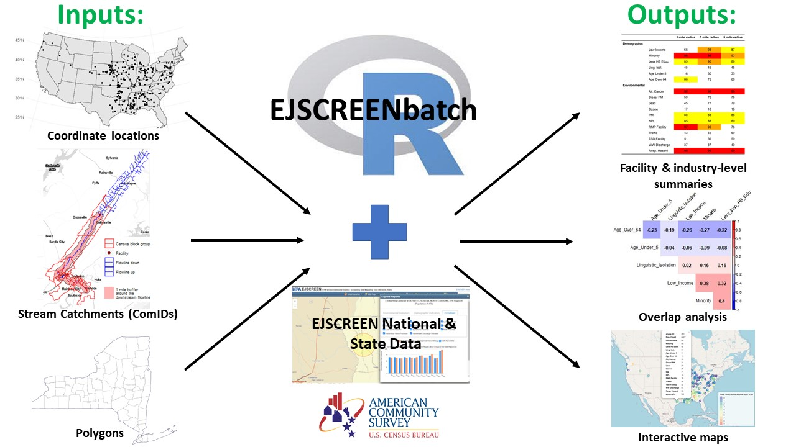

<!-- README.md is generated from README.Rmd. Please edit that file -->

# EJSCREENbatch

<!-- badges: start -->

<!-- badges: end -->

As of 1/3/2022 Version 2.0 is now available!

To streamline initial EJ analysis efforts over *multiple locations of
interest*, the EJSCREENbatch R package was developed to leverage the
national demographic and environmental datasets made available through
the U.S. Environmental Protection Agency.

This package offers canned functions to extract and process Census block
group EJSCREEN data for buffered areas surrounding user-provided [sf
geographies](https://r-spatial.github.io/sf/). Users can request
different buffer distances or GIS inclusion methods. Moreover, buffers
can be distance-based over land (i.e. drawing circles around lat/longs)
or water (leveraging the [NHDPlus
network](https://usgs-r.github.io/nhdplusTools/) to measure
up/downstream).

A number of standardized, secondary data visualization functions are
also available: correlation plots, heat tables, ranking tables, and maps
are among current offerings.

## Installation

You can install the *development* version of EJSCREENbatch from GitHub
with the following:

``` r
# requires devtools to install
install.packages('devtools')
library(devtools)

# install from repository
install_github('USEPA/EJSCREENbatch')
library(EJSCREENbatch)
```

To install from GitHub with package vignettes:

``` r
library(devtools)
install_github('USEPA/EJSCREENbatch', build_vignettes=TRUE)
library(EJSCREENbatch)
```

*NOTE:* in this developmental version of the package, users must
manually download NASA’s [SEDAC population density raster
file](https://sedac.ciesin.columbia.edu/data/set/usgrid-summary-file1-2010/data-download)
and point the function towards where it is housed locally. Unfortunately
this download requires creation of a (free) account; users should
download the geotiff version of the raster files.

Users should also note that when the package is installed, the most recent release of EJSCREEN data is downloaded. EJSCREEN is updated periodically so if users want to ensure that they are using the most recent release, they will need to delete their local copy to allow the package to automatically pull the most current version. This design choice was made to ensure reproducibility between runs.  

## Description

Below is a visual overview of the package, highlighting the input types, primary data sources, and examples of output graphics. Three primary data types can be input: coordinates, NHDplus common identifiers (ComIDs), and shape files (polygons). The package offers two buffering methods and can accept multiple buffer distances at a time. The user can chose to output summary plots and tables in addition to the returned raw dataframe. Additional documentation and a demonstration on how to leverage the package's functional are available in the vignette directory.



## EPA Disclaimer

The United States Environmental Protection Agency (EPA) GitHub project
code is provided on an “as is” basis and the user assumes responsibility
for its use. EPA has relinquished control of the information and no
longer has responsibility to protect the integrity , confidentiality, or
availability of the information. Any reference to specific commercial
products, processes, or services by service mark, trademark,
manufacturer, or otherwise, does not constitute or imply their
endorsement, recommendation or favoring by EPA. The EPA seal and logo
shall not be used in any manner to imply endorsement of any commercial
product or activity by EPA or the United States Government.

## License

This project is licensed under the MIT license.
